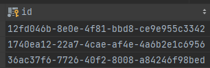

# 개요

프로젝트에서 JPA환경에서 UUID를 PK로 도입하는 과정에서 불편했던 점들과 개선한 경험들을 기록한다.

## UUID란? + 도입 고민

**UUID**(`범용 고유 식별자(universally unique identifier)`)는 128비트의 수이다. 표준 형식에서 UUID는 32개의 16진수로 표현되며 총 36개 문자(32개 문자와 4개의 하이픈)로 된 8-4-4-4-12라는 5개의 그룹을 하이픈으로 구분한다. 이를테면 다음과 같다.

> `550e8400-e29b-41d4-a716-446655440000`

위에서 UUID에 대해 살짝 알아봤다.

필자는 UUID는 `거의 중복되지 않는 글로벌 유니크 값이다` 라는 것에 주목했고, React Dom이 변경 감지를 하는 기준이 key값인데 key값은 중복되기 쉽다는 이야기를 듣고 UUID를 사용한다면 front에서 쉽게 작업을 하지 않을까? 라는 생각에 도입을 시도해봤다. 또한 글로벌 서비스까지 고려하던 상황에서  (지극히 개인적인 의견이긴 하다)

## BINARY(16)

UUID 도입을 고려하면서 구글링해보니 DB의 BINARY 타입이 padding이 생겨서 UUID는 16byte이기에 225byte타입으로 column을 정의한다면 데이터를 제대로 조회하지 못하는 이슈가 생길 수 있다는 글들을 보았고,
다음과 같이 `@Column(columnDefinition = "BINARY(16)")` 를 사용해서 UUID를 안전하게 조회하는 방법을 선택했었다.

``` java
@Id
@GeneratedValue(generator = "uuid2")
@GenericGenerator(name = "uuid2", strategy = "uuid2")
@Column(columnDefinition = "BINARY(16)")
private UUID id;
```

하지만 이렇게 선언해놓고 당시 개발 단계여서 DB 데이터와 비교하며 디버깅을 해보려고 DB 툴을 이용해 DB 테이블을 조회했더니 다음과 같이 사람이 쉽게 알아볼 수 없는 상황이 되었다..


물론 DB 함수들을 이용해서 깔끔하게 볼 수 있겠지만, 매번 하기에는 굉장히 귀찮은 일이다.
그래서 이를 varchar로 변경할 수 있는 방법을 찾기 시작했다.

## 칼럼 타입을 varchar로 선언하기 (uuid-char)

구글링 끝에 다음과 같이 `@Type(type="uuid-char")`를 이용하면 varchar로 저장할 수 있다는 것을 확인했고 이를 적용해봤다.

``` java
@Id
@GeneratedValue(generator = "uuid2")
@GenericGenerator(name = "uuid2", strategy = "org.hibernate.id.UUIDGenerator")
@Type(type = "uuid-char")
private UUID id;
```

그 결과는!! 필자가 원하는대로 사람이 알아보기 편하게 변경되었다 !



## Reference

- <https://jehuipark.github.io/java/my-sql-binary-reference>
