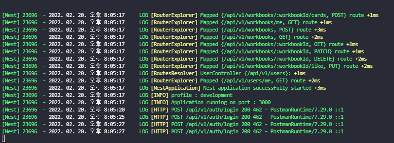
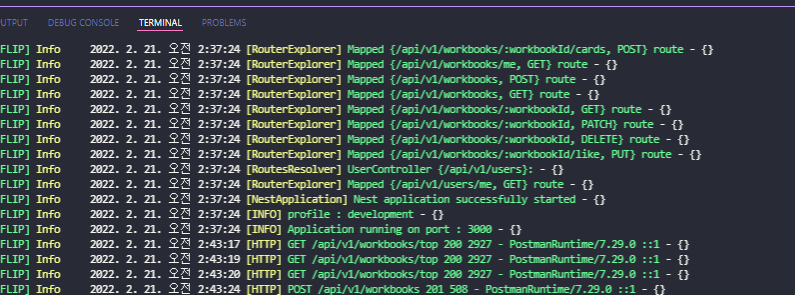
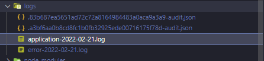
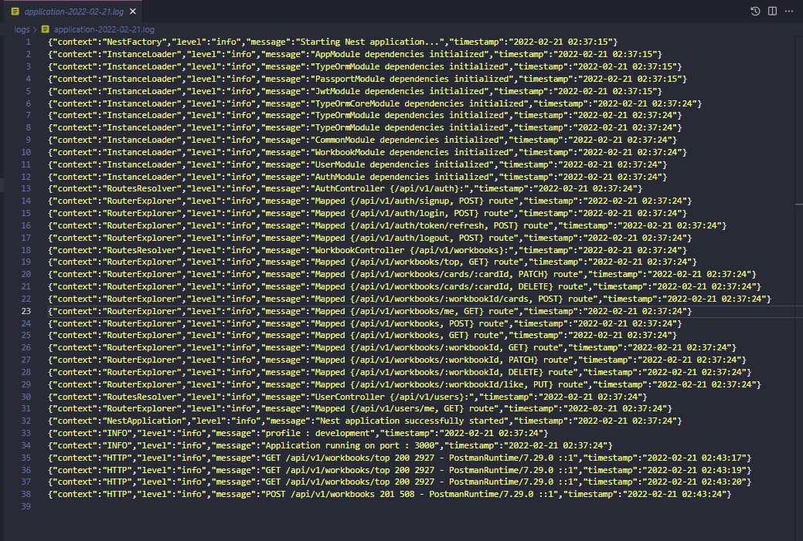

# [nestjs] log를 남겨보자

nestjs로 사이드 프로젝트를 개발하면서 winston을 이용해 logging을 적용한 경험을 기록합니다.

다음 순서로 기록합니다.

- http-logger-middleware 적용 (morgan X)
- nest-winston + winston-daily-rotate-file

## log를 남겨야하는 이유

log를 남겨야하는 이유는 다양하겠지만 내가 해당 사이드 프로젝트에서 log를 남겨야겠다고 생각한 이유는 다음과 같다. 보통 피드백과 관련된 내용이다.

- 안정된 서비스를 위해 log를 통한 서비스 상태 및 로직을 추적
- error 발생 시에 error 상황 추적
- file 형태로 log를 남겨 위 과정을 좀 더 유연하게 만들기
- 로그를 활용한 모니터링 환경 구축

## http-logger-middleware 적용하기

먼저, 기존 nodejs 프로젝트에서 사용하던 [morgan](https://www.npmjs.com/package/morgan) module처럼 http 요청 정보를 logging 해주는 기록하는 것이 필요했다.
그래서 가장 먼저 떠오른 morgan을 [nest-morgan](https://www.npmjs.com/package/nest-morgan)을 이용해서 적용해보았으나 해당 package는 deprecated 되어있었고, 출력되는 내용도 내가 원하던 형식은 아니였다.

결국 간단하게 **http-logger-middeleware는 직접 구현**하기로 했다.

구현한 http-logger middleware는 다음과 같다. 기존에 사용하던 morgan의 형태와 비슷한 형태이다.
[Youtube](https://www.youtube.com/watch?v=OdSaI_S7uwM) http-logger를 만드는 영상이 있어 참고했다. 


``` ts
// http-logger.middleware.ts

import { Injectable, Logger, NestMiddleware } from '@nestjs/common';
import { NextFunction, Request, Response } from 'express';

@Injectable()
export class HttpLoggerMiddleware implements NestMiddleware {
  private logger = new Logger('HTTP');

  use(request: Request, response: Response, next: NextFunction) {
    const { ip, method, originalUrl } = request;
    const userAgent = request.get('user-agent') || '';

    response.on('finish', () => { // (1)
      const { statusCode } = response;
      const contentLength = response.get('content-length');

      this.logger.log(
        `${method} ${originalUrl} ${statusCode} ${contentLength} - ${userAgent} ${ip}`,
      );
    });

    next();
  }
}
```

- (1) response의 finish eventListener : node에서 http response 전송 시에 emit 하는 finish 이벤트를 catch 한다 [node.js event-finish](https://nodejs.org/api/http.html#event-finish)

위 middleware를 구현하고, 아래와 같이 최상위 모듈인 `AppModule`에 HttpLoggerMiddleware를 적용했다.

``` ts
// app.module.ts 

@Module({
  imports: [
    TypeOrmModule.forRoot(typeORMConfig),
    AuthModule,
    WorkbookModule,
    UserModule,
    CommonModule,
  ],
})
export class AppModule implements NestModule {
  configure(consumer: MiddlewareConsumer) {
    consumer.apply(HttpLoggerMiddleware).forRoutes('*');
  }
}

```

이후 API를 테스트해본 결과 다음과 같이 출력되는 것을 확인했다.




## file 형태로 log를 기록하자

보통 서버 배포 시에 nohub을 이용해 출력 로그가 기록되긴하지만, 관리가 어렵고 로그를 따로 파일로 정리해서 저장하는 것이 필요하다고 판단했고, file 형태로 log를 따로 저장하기로 했다.

node에서 익숙한 [winston](https://www.npmjs.com/package/winston) module을 사용하고 싶었고, [nest-winston](https://github.com/gremo/nest-winston) 모듈을 발견했고 빠르게 적용해볼 수 있었다.

또한 날짜별로 파일을 저장하기 위해 [winston-daily-rotate-file](https://www.npmjs.com/package/winston-daily-rotate-file) module을 이용했다


``` shell
npm install nest-winston winston
npm install winston-daily-rotate-file
```


``` ts
// logger-config.ts

import {
  utilities as nestWinstonModuleUtilities,
  WinstonModule,
} from 'nest-winston';
import { format, Logform, transports } from 'winston';
import 'winston-daily-rotate-file';

export class LoggerConfig {
  static createApplicationLogger() {
    return WinstonModule.createLogger({
      format: format.combine(
        format.timestamp(),
        nestWinstonModuleUtilities.format.nestLike('FLIP'), // (1)
      ),
      transports: [
        new transports.Console({}),
        new transports.DailyRotateFile({ // (2)
          format: this.logFileFormat(),
          filename: 'application-%DATE%.log', // (3)
          dirname: 'logs',
          datePattern: 'YYYY-MM-DD-HH',
          zippedArchive: true,
          maxSize: '20m', 
          maxFiles: '14d', 
        }),
        new transports.DailyRotateFile({
          format: this.logFileFormat(),
          level: 'error',
          filename: 'error-%DATE%.log',
          dirname: 'logs',
          datePattern: 'YYYY-MM-DD',
          zippedArchive: true,
          maxSize: '20m',
          maxFiles: '14d',
        }),
      ],
    });
  }

  private static logFileFormat(): Logform.Format {
    return format.combine(
      format.timestamp({ format: 'YYYY-MM-DD HH:mm:ss' }),
      format.printf((info) => JSON.stringify(info)), // (4)
    );
  }

```

- (1) nest-winston 모듈에 기존 nest log와 비슷하게 출력 포멧을 정해주는 유틸이 있어 사용했다. FLIP은 사이드 프로젝트 이름이다. 아무거나 입력해도 된다.
- (2) `winston-daily-rotate-file`의 `DailyRotateFile()`을 이용해 파일을 시간에 따라 바꾸게 한다.
- (3) %DATE%에는 시간 포맷(datePattern)값이 입력된다. ex) application-2022-02-21.log
- (4) 해당 포멧은 logFile에 저장될 포멧이다 자신이 원하는 형식을 선택하자.


이후 main.ts bootstrap()에서 기본 logger를 변경해주었다.

``` ts
// main.ts
import { LoggerConfig } from './common/config/logger-config';

async function bootstrap() {
  const appOptions: NestApplicationOptions = {
    logger: LoggerConfig.createApplicationLogger(),
  };

  const app = await NestFactory.create(AppModule, appOptions);

  // ...
}
```


## 마무리

다음은 위 코드를 테스트한 결과이다. (http-logger, log files)



log files



