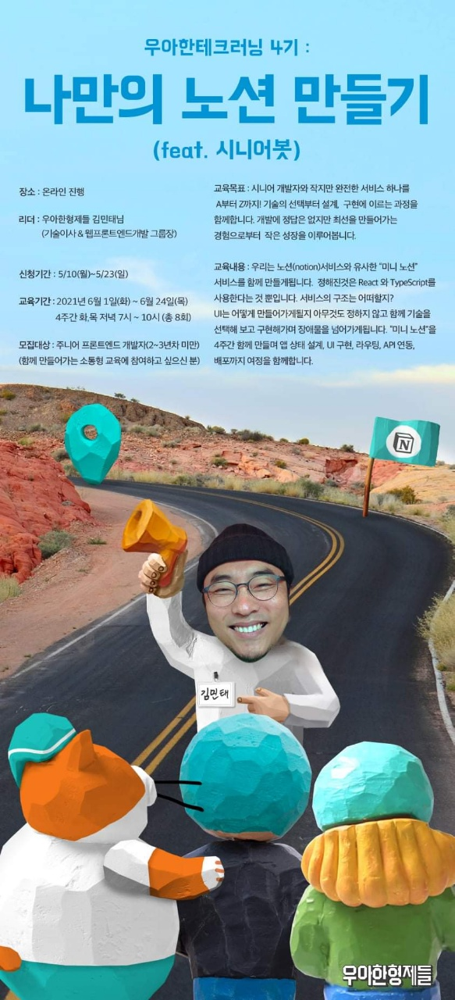
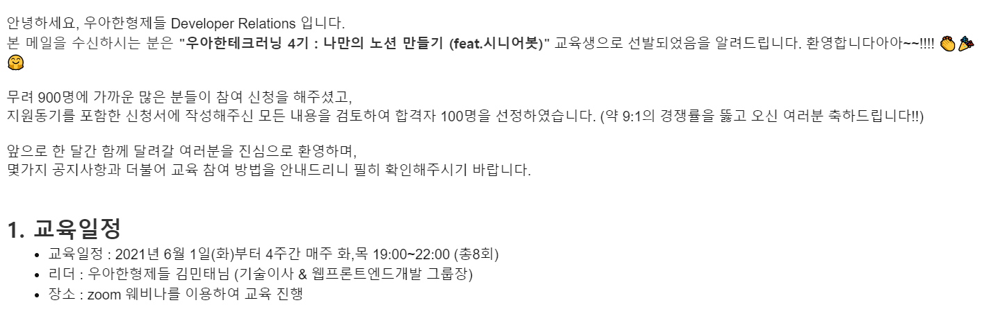

# 우아한테크러닝 4기 회고

# 개요

21.06.01 ~ 21.06.24 4주간 온라인으로 진행된 우아한 테크러닝 4기에 대한 회고 글입니다.

# 우아한테크러닝 4기

우아한테크러닝 4기는 김민태 이사님께서 리드해주시고

6월 1일 ~ 6월 24일까지 매주 화, 목 2번씩 총 8회 온라인으로 진행한 교육 프로그램입니다.

# 지원 동기와 선발 과정

저는 학교에서부터 백엔드 개발을 주로 해오다가 최근에 프론트쪽에 관심이 생겨서 개인적으로 공부하고 있었는데요!

저는 GitHub의 `Dev-Event` 리포를 통해서 우아한테크러닝에 대해서 알게 되었습니다.

당시에 소통형 교육에 참여해서 많은 이야기를 공유하고 싶었고, 언젠가 시니어 개발자가 되는 것을 준비하기 위해서 시니어 개발자의 시선도 궁금했어요 그리고 우아한형제들에 관심이 있기도 해서 지원하게 되었습니다!

하지만 용기가 부족해서 마이크로 말하진 못했어요,, 다음 교육 시간에 제가 말하고 싶은 내용을 민태님이 언급하셔서 말할 걸 그랬나,, 하고 후회하기도 했습니다 ㅠㅠ,,
역시 기회는 용기있고 간절한 사람들이 잡는 것..

지원서 제출 후에 떨리는 마음으로 주기적으로 메일함을 확인하며 결과를 기다리고 있던 중,,

두구두구,,

우아한테크러닝 참여 안내 이메일이 도착했습니다!!!!

그러나.. 기뻤던 것도 잠시..

# 이 땐 알지 못했습니다..

제가 1시간 정도 걸리는 퇴근 길에 핸드폰으로 교육에 참여하게 될 줄은...

사실 교육을 받는 도중에 산업기능요원 백엔드 개발자로 첫 취업을 하게 되었는데요!✌

해당 글 작성하는 시간 기준으로 4주차입니다 ㅎㅎ,, (6월 7일 첫 출근)

아무튼 퇴근 시간이 7시라서 어쩔 수 없이 퇴근과 동시에 핸드폰으로 교육에 참여해야 했습니다😂

사실 회사에서는 6시에 퇴근하라고 배려해주셨어요!

하지만 제 욕심으로 7시에 퇴근하기로 했습니다 ㅎㅎ..

제가 실무 프로젝트를 너무 하고싶어서 어필했고, 원래 1달간 교육 기간이었지만, 팀장님이 저를 마음에 들어하셔서 믿어주시기도 했고,, 결국 개발에 참여하게 되었어요! 첫 회사에서의 첫 프로젝트여서 잘 마무리하고 싶은 욕심이 있었답니다 ㅎ,ㅎ

# 모바일 참여에 의한 문제점과 개선

저는 매 회차 교육 내용을 Notion에 정리했었는데요!
출근 전과 후에 작성한 내용을 비교하면 내용 차이가..........

핸드폰으로 강의를 보면서 메모하랴,,, 퇴근 길 대중교통 전쟁에 참전하랴,,, 쉽지 않더라구요😅

회사에 다니면서 강의에 참여하시는 분들 모두 정말 대단하신 것 같아요

결국 이건 아니다 싶어서 회사에서 교육을 모두 듣고 집 가는 등.. 여러 방안을 이용해서 이를 개선하고 굳은 의지로 모든 교육 시간에 참여했습니다!✌

# 본론으로 들어가서

이제 본론으로 들어가서 각 회차별로 구체적인 내용을 다루기에는 글이 너무 길어질 것 같아서 인상적이었던 것들 기준으로 교육 받은 4주(8일) 동안에 제가 느낀 것들을 적어보려고 해요.

가능하다면 댓글로 이 글을 읽으시는 여러분들의 생각도 공유해주세요!

# 민태님은 엄청 멋있는 분이었다

우선 교육 시간 내내 민태님의 내공이 느껴지고 여유로움에 감탄하는 시간이었어요.

라이브 코딩, 공유해주시는 인사이트의 깊이와 영감 그리고 많은 참여자들을 리드하는 멘트들 등

화면 상으로 보고 듣는 것만으로도 기술적으로나 인간적으로나 정말 배울 것이 많은 멋진 분이다 라고 느꼈어요.

그리고 이런 분이 기술 이사로 계신 곳은 어떤 환경일까 더욱더 궁금해지는 시간이기도 했습니다.

# 시니어 개발자로 가는 길

테크러닝에 참여하면서 지금 주니어 개발자인 내가 미래에 시니어 개발자가 되기 위해선 어떤 역량이 필요할까? 라는 고민을 했어요

이것에 대한 정답을 찾는 것이 제가 테크러닝에 참여한 이유 중 하나이기도 했고 참여자분들과 민태님의 이야기에서 어느 정도 힌트를 얻은 것 같아요.

## 길잡이

테크러닝 참여자분들 중 주니어 개발자 분들이 많았어요. 그리고 많은 분들이 시니어 개발자에게 원하는 것들 중 하나는 "`길잡이 역할`"였습니다. 그리고 저 역시도 주니어 개발자인 입장에서 길잡이가 되어줄 사람을 원하고 있었어요.

명확히 말해서 제가 원하는 건 `과외 선생님`이 아니라 `듬직한 리더`였어요. 이 사람과 함께하면 무엇이든 할 수 있겠다 라는 느낌이 드는 사람이요.

기술적인 것은 당연했고, 인간적인 부분을 채우는 것이 어렵고 중요한 것 같아요.

 

그렇다면 좋은 길잡이는 어떤 행위를 할 수 있겠는가?를 생각해보니 다음과 같은 결론을 내렸어요

가장 기본이 되는 건 다음과 같고 이후에 각자의 성향이 나뉜다고 생각해요.

1. 서로 인사이트를 공유하고 같이 고민하거나 조언을 할 수 있어야 한다.
2. 그리고 그 과정에 의한 기술 선택이 `안정적인 결과`로 이어지게 해야한다.

 

사실 인사이트를 공유하고, 같이 고민하거나 조언을 하는 건 누구나 할 수 있겠다는 생각이 들었어요. 하지만, 그 조언이나 고민들로 인한 선택의 결과가 안정적이고 긍정적으로 이어지게 하는 건 아무나 못 하겠더라구요.

그리고 이는 **경험에 의한 노하우나 깊고 핵심적인 고민에 의해서 이루어질 수 있겠구나** 라는 결론을 내렸습니다. **결국 많은 시도와 경험을 해봐야한다는 것이죠. 실패하든 성공하든 똑똑하게!**

# 기술을 대하는 자세

민태님께서 해주셨던 여러 이야기 중에 **보통 기술에는 핵심 컨셉이 있고, 이 컨셉을 이해하는 것은 기술의 선택과 학습에 있어서도 도움이 된다**라는 말이 인상적이었어요.

평소에 모든 행동에 WHY? HOW? 라는 질문을 하는 것이 올바른 이해에 도움이 된다라고 생각하고 있었는데, 이와 연관된 여러가지가 한 문장으로 정리되면서 영감을 얻는 느낌이었어요.

앞으로 경험할 여러 기술에 대한 깊은 이해에 있어서 큰 도움이 될 문구라는 생각이 듭니다.

# 마치며

처음 회고글을 작성하다보니 썼다 지웠다를 수없이 반복한 것 같아요.. 쓰는 도중에도 많은 고민을 하고 ㅎㅎ,, 피드백은 언제나 환영입니다! 댓글을 남겨주세요!

사실 엄청 긴 내용을 작성했었는데 쓰다보니 우아한테크러닝에 대한 회고가 아니라 다른 글이 되어가는 것 같아서 많이 줄였습니다 ㅎㅎ,,

아! 그리고 시니어 개발자로 가는 길에 대한 내용을 담긴 했지만, 가장 중요한 건 내가 어떤 개발자가 되고 싶은가? 인 것 같아요 그런데 이건 너무 길어질 수도 있을 것 같아서 따로 글을 작성할 계획입니당

아무튼 6월은 정말 바쁘게 지나간 것 같아요 테크러닝같이 값진 경험도 하고 주니어 개발자 취업도 있었고,, 아직 부족하지만,, 6월 입사 후부터 좋은 개발 환경, 문화를 만들고 싶어서 스터디를 주최하거나 CI/CD 환경을 구축한다거나 여러 시도를 하고 있어요. 곧 첫 스터디가 마무리되는데 참여자분들의 후기가 기대됩니다 ㅎㅎ,,

마지막으로, 테크러닝을 통해서 배민의 여러 개발자분들을 만나고 싶은 마음이 더 커진 것 같아요 ㅎㅎ 언젠가 기회가 생기면 좋겠네요!

그리고 이런 유익한 활동을 주최해주시는 우아한형제들 관계자분들께도 감사의 말을 전하고 싶어요

감사합니다!!👍

이 글을 보고 계신 분들 중에 테크러닝에 참여할 기회가 생기다면, **꼭 도전해보세요! 강추!!**
